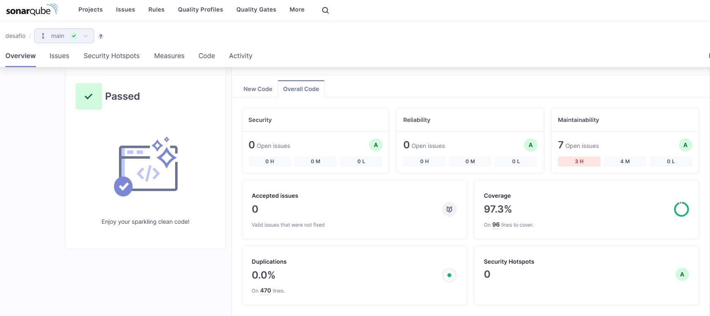
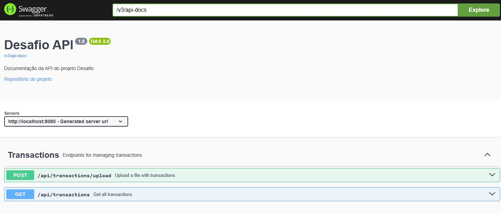

<details>
<summary>Desafio Proposto</summary>

# Desafio programação - para vaga desenvolvedor

Por favor leiam este documento do começo ao fim, com muita atenção.
O intuito deste teste é avaliar seus conhecimentos técnicos em programação.
O teste consiste em parsear [este arquivo de texto(CNAB)](https://github.com/ByCodersTec/desafio-ruby-on-rails/blob/master/CNAB.txt) e salvar suas informações(transações financeiras) em uma base de dados a critério do candidato.
Este desafio deve ser feito por você em sua casa. Gaste o tempo que você quiser, porém normalmente você não deve precisar de mais do que algumas horas.

# Instruções de entrega do desafio

1. Primeiro, faça um fork deste projeto para sua conta no Github (crie uma se você não possuir).
2. Em seguida, implemente o projeto tal qual descrito abaixo, em seu clone local.
3. Por fim, envie via email o projeto ou o fork/link do projeto para seu contato Bycoders_ com cópia para rh@bycoders.com.br.

# Descrição do projeto

Você recebeu um arquivo CNAB com os dados das movimentações finanaceira de várias lojas.
Precisamos criar uma maneira para que estes dados sejam importados para um banco de dados.

Sua tarefa é criar uma interface web que aceite upload do [arquivo CNAB](https://github.com/ByCodersTec/desafio-ruby-on-rails/blob/master/CNAB.txt), normalize os dados e armazene-os em um banco de dados relacional e exiba essas informações em tela.

**Sua aplicação web DEVE:**

1. Ter uma tela (via um formulário) para fazer o upload do arquivo(pontos extras se não usar um popular CSS Framework )
2. Interpretar ("parsear") o arquivo recebido, normalizar os dados, e salvar corretamente a informação em um banco de dados relacional, **se atente as documentações** que estão logo abaixo.
3. Exibir uma lista das operações importadas por lojas, e nesta lista deve conter um totalizador do saldo em conta
4. Ser escrita na sua linguagem de programação de preferência
5. Ser simples de configurar e rodar, funcionando em ambiente compatível com Unix (Linux ou Mac OS X). Ela deve utilizar apenas linguagens e bibliotecas livres ou gratuitas.
6. Git com commits atomicos e bem descritos
7. PostgreSQL, MySQL ou SQL Server
8. Ter testes automatizados
9. Docker compose (Pontos extras se utilizar)
10. Readme file descrevendo bem o projeto e seu setup
11. Incluir informação descrevendo como consumir o endpoint da API

**Sua aplicação web não precisa:**

1. Lidar com autenticação ou autorização (pontos extras se ela fizer, mais pontos extras se a autenticação for feita via OAuth).
2. Ser escrita usando algum framework específico (mas não há nada errado em usá-los também, use o que achar melhor).
3. Documentação da api.(Será um diferencial e pontos extras se fizer)

# Documentação do CNAB

| Descrição do campo  | Inicio | Fim | Tamanho | Comentário
| ------------- | ------------- | -----| ---- | ------
| Tipo  | 1  | 1 | 1 | Tipo da transação
| Data  | 2  | 9 | 8 | Data da ocorrência
| Valor | 10 | 19 | 10 | Valor da movimentação. *Obs.* O valor encontrado no arquivo precisa ser divido por cem(valor / 100.00) para normalizá-lo.
| CPF | 20 | 30 | 11 | CPF do beneficiário
| Cartão | 31 | 42 | 12 | Cartão utilizado na transação
| Hora  | 43 | 48 | 6 | Hora da ocorrência atendendo ao fuso de UTC-3
| Dono da loja | 49 | 62 | 14 | Nome do representante da loja
| Nome loja | 63 | 81 | 19 | Nome da loja

# Documentação sobre os tipos das transações

| Tipo | Descrição | Natureza | Sinal |
| ---- | -------- | --------- | ----- |
| 1 | Débito | Entrada | + |
| 2 | Boleto | Saída | - |
| 3 | Financiamento | Saída | - |
| 4 | Crédito | Entrada | + |
| 5 | Recebimento Empréstimo | Entrada | + |
| 6 | Vendas | Entrada | + |
| 7 | Recebimento TED | Entrada | + |
| 8 | Recebimento DOC | Entrada | + |
| 9 | Aluguel | Saída | - |

# Avaliação

Seu projeto será avaliado de acordo com os seguintes critérios.

1. Sua aplicação preenche os requerimentos básicos?
2. Você documentou a maneira de configurar o ambiente e rodar sua aplicação?
3. Você seguiu as instruções de envio do desafio?
4. Qualidade e cobertura dos testes unitários.

Adicionalmente, tentaremos verificar a sua familiarização com as bibliotecas padrões (standard libs), bem como sua experiência com programação orientada a objetos a partir da estrutura de seu projeto.

# Referência

Este desafio foi baseado neste outro desafio: https://github.com/lschallenges/data-engineering

---

Boa sorte!
</details>

# Projeto Desafio

## Tecnologias Utilizadas

- **Java**: Linguagem de programação utilizada na aplicação.
- **Spring Boot**: Framework para construção da aplicação.
- **Maven**: Ferramenta de automação de build utilizada para gerenciar dependências e construir o projeto.
- **PostgreSQL**: Banco de dados utilizado para armazenar os dados da aplicação.
- **Docker**: Plataforma de containerização utilizada para executar a aplicação e o banco de dados.
- **Angular**: Framework para construção da interface do usuário.

## Pré-requisitos

### No geral só precisa do docker e docker-compose para rodar, mas se quiser rodar localmente cada aplicação , precisa de:

- **Java 17**: Certifique-se de ter o Java 17 instalado.
- **Maven**: Certifique-se de que o Maven está instalado e configurado.
- **Docker**: Instale o Docker para executar a aplicação em um container.
- **Node.js e npm**: Certifique-se de ter o Node.js e o npm instalados para executar o Angular.

## Iniciando o Projeto

### Clonar o Repositório

- Clone o repositório para a sua máquina local
```sh
git clone https://github.com/teonasnetto/desafio.git
```
- Navegue até a pasta do projeto
```sh
cd desafio
```
- Execute o comando `docker-compose up --build` para iniciar a aplicação
```sh
docker-compose up --build
```
- Acesse a aplicação em `http://localhost:8081`
- Acesse o Swagger em `http://localhost:8080/swagger-ui/index.html`
- Json do swagger em `http://localhost:8080/v3/api-docs`
- Health check em `http://localhost:8080/actuator/health`

## Testando a Aplicação

### Requisição de Exemplo

Você pode usar o `curl` para testar a aplicação. Aqui está um exemplo de como fazer uma requisição GET:


- **POST /api/transactions/upload**: Envia um arquivo CNAB para ser processado.

```sh
curl --location 'http://localhost:8080/api/transactions/upload' \
--header 'Cookie: JSESSIONID=A2D49EB858413A9DB0BCD02F0F05E846' \
--form 'file=@"file.txt"'
```

- **GET /api/transactions**: Retorna todas as transações processadas.
```sh
curl --location 'http://localhost:8080/api/transactions'
```

# imagens de exemplo

## Sonarqube


## Swagger
